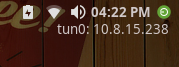

# iip
----------------

I wrote this script to help with tryhackme. Every time I need my IP address I don't have to write `ip addr show tun0`. Just install the 'xfce4-genmon-plugin' and your good to go.

